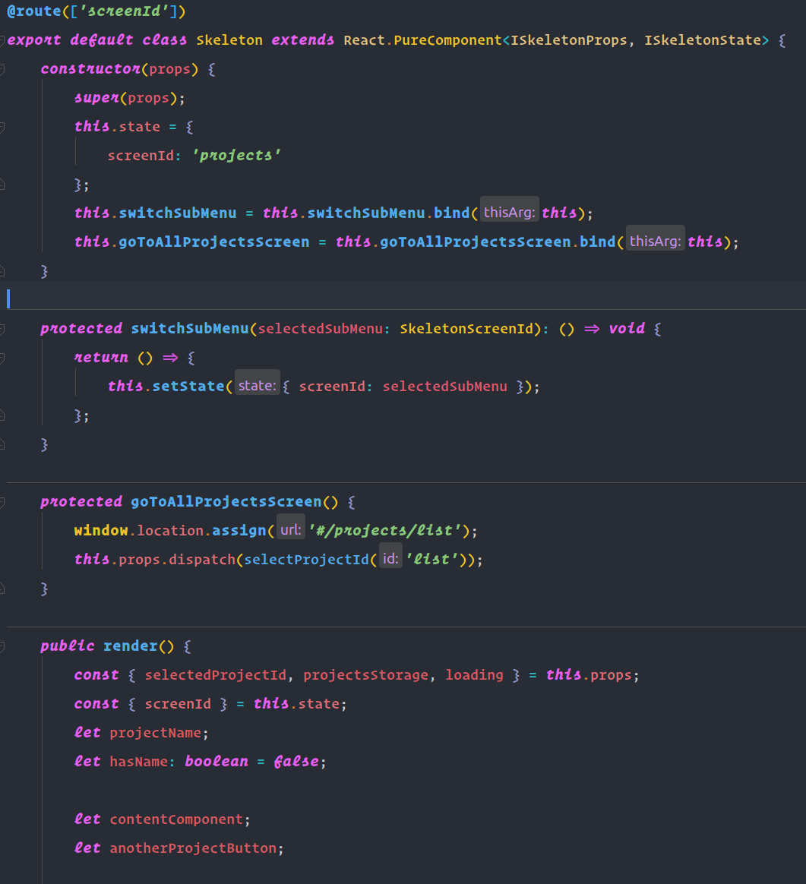

# Vivid One Dark WebStorm theme

Vivid One Dark theme for WebStorm. Inspired by [One Dark Pro](https://github.com/Binaryify/OneDark-Pro) theme for VsCode.



## Installation

1. Go to ``` (Settigns|Preferences) -> Editor -> Color Scheme ```
1. Push button next to drop-down list and choose ``` Import Scheme ```
1. Choose ``` Vivid One Dark.icls ```
1. Now you can choose Vivid One Dark scheme from drop-down list
